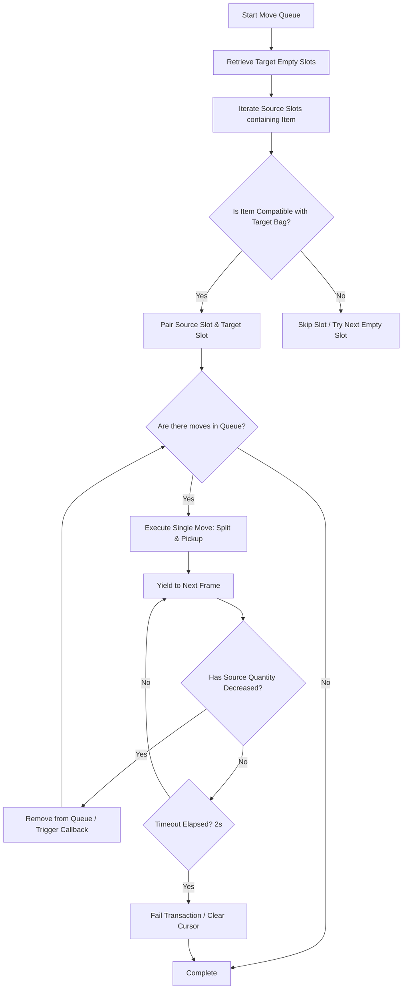

### 1. Core Abstractions & Data Structures

* **Slot Identifier (`SlotId`)**: Do not use objects/tables to represent slots (this causes Garbage Collection spikes). Instead, pack the two indices into a single integer:
  $$\text{SlotId} = (\text{BagID} \times 1000) + \text{SlotIndex}$$
  * **`encode_bagslot(bag, slot)`**: Converts a separate `bag` index and `slot` index into a packed `SlotId` integer: `bag * 1000 + slot`.
  * **`decode_bagslot(slotId)`**: Unpacks the single `SlotId` integer back into its constituent `bag` and `slot` numbers: `bag = math.floor(slotId / 1000)` and `slot = slotId % 1000`.
  * > [!WARNING]
  * > Older addons (like BankStack) historically used a multiplier of 100 (e.g., `bag * 100 + slot`). This is **deprecated and unsafe** in modern World of Warcraft. A multiplier of **1000** is mandatory because bags and bank tabs can now hold 100 or more slots, which causes ID collisions with a 100 multiplier.
* **Move Context Class**: Create a class structure (or tables with strategy functions) for each type of move direction (e.g., `BagToBank`, `BankToBag`, `BagToGuildBank`, `GuildBankToBag`). Each context must implement:
  * `MoveSlot(fromSlotId, toSlotId, quantity)`
  * `GetSlotQuantity(slotId)`
  * `GetEmptySlots(emptySlotIdsTable)`
  * `SlotIdIterator(itemString)`

---

### 2. WoW API Adapter (Retail & Classic Compatibility)

Wrap all Blizzard API interactions to ensure cross-version compatibility:

| Action | WoW API (Classic / Modern) | Details / Safety Checks |
| :--- | :--- | :--- |
| **Get Stack Count** | `C_Container.GetContainerItemInfo(bag, slot).stackCount` | If return is nil, slot is empty. |
| **Split Container Item** | `C_Container.SplitContainerItem(bag, slot, count)` | Places `count` items from slot onto cursor. |
| **Pick up Container Item** | `C_Container.PickupContainerItem(bag, slot)` | Swaps item on cursor with destination slot. |
| **Split Guild Bank Item** | `SplitGuildBankItem(tab, slot, count)` | Places `count` items from Guild Bank slot onto cursor. |
| **Pick up Guild Bank Item** | `PickupGuildBankItem(tab, slot)` | Swaps item on cursor with Guild Bank tab slot. |
| **Check Cursor** | `GetCursorInfo()` | Returns `"item"`, `"money"`, etc. MUST check before and during moves. |
| **Clear Cursor** | `ClearCursor()` | Destroys/returns items held on cursor. Run after every move. |

---

### 3. Step-by-Step Move Algorithm

Your implementation must follow this exact transaction lifecycle:



#### Step 3.1: Pre-Move Validation & Filtering
1. **Cursor Safety**: Assert that `GetCursorInfo() == nil`. If the cursor is holding an item, abort immediately to prevent overwriting or deleting the user's item.
2. **Soulbound Checks**: When moving to a Guild Bank, verify `C_Container.GetContainerItemInfo(bag, slot).isBound` is false. Soulbound items cannot be deposited.

#### Step 3.2: Empty Slot Prioritization
To prevent general items from cluttering specialized bags (e.g., Herb bags, Reagent bags):
1. Query bag item family via `C_Container.GetContainerIDToInventoryID(bag)` and `C_Item.GetItemFamily(bagLink)`.
2. Map empty slots to their bag family.
3. Sort empty slots: Prioritize specialized bags (`family ~= 0`) before general bags (`family == 0`).
4. Only pair an item string with an empty slot if the item's family matches the bag's family (or if the bag is general).

#### Step 3.3: Execution & The Cooperative Yield Loop
All moves must run inside a coroutine scheduler:
1. **Unify Split Commands**: Always use `C_Container.SplitContainerItem(fromBag, fromSlot, quantity)` (or `SplitGuildBankItem` for guild bank) to place items on the cursor, even if moving a full stack.
2. **Cursor Placement**: If `GetCursorInfo() == "item"`, call `C_Container.PickupContainerItem(toBag, toSlot)` (or `PickupGuildBankItem`) to drop the items.
3. **Clear Cursor**: Always call `ClearCursor()` at the end of the transaction step to prevent cursor pollution if a packet drops.
4. **Cooperative Yielding**: Yield execution using the native Lua standard `coroutine.yield()` function (which is built into WoW's Lua API sandbox environment) after triggering a move. This yields control back to your scheduler on the main frame update hook (e.g. `OnUpdate`), giving the game client time to communicate with the server and fire container events.
5. **Cursor Lock Recovery (Retry Loop)**: If the item gets stuck on the cursor (due to latency dropping the placement click), verify if `GetCursorInfo() == "item"` and the item matches the expected target. Attempt to repeat the drop click (`PickupContainerItem` or `PickupGuildBankItem`) up to 5 times, yielding between retries, before aborting.

#### Step 3.4: Guild Bank Rate-Limit Throttling
* **Throttling Constraint**: Blizzard severely limits the speed of Guild Bank operations. You **MUST NOT** perform multiple guild bank actions in a single frame.
* **Throttling Solution**: When moving to/from a Guild Bank, execute **only one move per yield cycle**. Wait for that specific slot transaction to be completely verified before initiating the next.

#### Step 3.5: Transaction Verification & Timeouts
Do not assume a move succeeded because the functions returned. You must verify it:
1. Define a timeout (e.g., `2` seconds).
2. Calculate the expected remaining quantity in the source slot:
   $$\text{ExpectedQty} = \max(\text{StartQty} - \text{MovedQty}, 0)$$
3. In a loop, yield execution and inspect the source slot's quantity.
4. If the source slot quantity becomes $\le \text{ExpectedQty}$, perform secondary verification: check if the destination slot now contains the expected item ID (unless performing a stack merge where the target slot already had that item).
5. If verified, mark the transaction as **SUCCESSFUL**, remove it from the pending queue, and progress.
6. If the timeout expires and the quantity has not decreased, mark the transaction as **FAILED**, clean the cursor with `ClearCursor()`, and halt/notify.

#### Step 3.6: Guild Bank Multi-Tab Orchestration
When a multi-tab queue is detected for a Guild Bank context:
1. The scheduler runs the sequential process inside `Mover.MoveMultiTabThread`.
2. For each target tab, it verifies if it matches the current tab via `GetCurrentGuildBankTab()`. If it does not:
   * It creates a temporary frame to listen to the `GUILDBANKBAGSLOTS_CHANGED` event.
   * It calls `SetCurrentGuildBankTab` and `QueryGuildBankTab` to trigger server-side content updates.
   * It yields the thread frame-by-frame until the loading event is fired or a 2-second timeout expires.
   * It unregisters and hides the frame.
3. It calls `Mover.MoveThread` synchronously for the items belonging to that tab index.
4. Any failure/timeout aborts the entire sequence to protect cursor state.

---

## Expected Code Structure (Skeleton to Implement)

Implement the module using this class structure pattern:

```lua
local ItemMover = {}
local SLOT_ID_MULTIPLIER = 1000

function ItemMover.encode_bagslot(bag, slot)
    return bag * SLOT_ID_MULTIPLIER + slot
end

function ItemMover.decode_bagslot(slotId)
    return math.floor(slotId / SLOT_ID_MULTIPLIER), slotId % SLOT_ID_MULTIPLIER
end

-- Threaded cooperative move runner
function ItemMover.MoveThread(moveQueue, context, callback)
    local emptySlots = {}
    context:GetEmptySlots(emptySlots) -- Sorted: specialized bags first
    
    local pending = {}
    -- Pair items to move with target slots
    for itemString, qtyToMove in pairs(moveQueue) do
        for sourceSlotId, currentQty in context:SlotIterator(itemString) do
            if qtyToMove > 0 then
                local targetSlotId = ItemMover.FindTargetSlot(itemString, emptySlots, context)
                if targetSlotId then
                    local moveQty = math.min(currentQty, qtyToMove)
                    pending[sourceSlotId] = {
                        target = targetSlotId,
                        qty = moveQty,
                        endQty = math.max(currentQty - qtyToMove, 0),
                        item = itemString
                    }
                    qtyToMove = qtyToMove - moveQty
                end
            end
        end
    end

    -- Process pending moves
    while next(pending) do
        local movedSlotId = nil
        
        -- Execute moves
        for srcSlotId, moveData in pairs(pending) do
            if GetCursorInfo() then ClearCursor() end
            context:MoveSlot(srcSlotId, moveData.target, moveData.qty)
            coroutine.yield() -- Yield to allow the client to process
            
            -- Cursor Lock Recovery: If item is stuck on cursor, retry the drop
            local cursorType, cursorItemId = GetCursorInfo()
            if cursorType == "item" and cursorItemId then
                local retries = 0
                while GetCursorInfo() == "item" and retries < 5 do
                    local tBag, tSlot = ItemMover.decode_bagslot(moveData.target)
                    context:PickupItem(tBag, tSlot) -- Retry drop click
                    coroutine.yield()
                    retries = retries + 1
                end
            end
            
            if context.isGuildBank then
                movedSlotId = srcSlotId
                break -- ONLY DO ONE GUILD BANK MOVE PER FRAME CYCLE
            end
        end

        -- Verify moves
        local didMove = false
        local timeout = GetTime() + 2 -- 2 second timeout
        while not didMove and GetTime() < timeout do
            for srcSlotId, moveData in pairs(pending) do
                if not context.isGuildBank or srcSlotId == movedSlotId then
                    -- Verify source quantity decreased AND target slot contains expected item ID
                    local srcQtyOk = context:GetSlotQuantity(srcSlotId) <= moveData.endQty
                    local tBag, tSlot = ItemMover.decode_bagslot(moveData.target)
                    local destItemIdOk = context:GetSlotItemId(tBag, tSlot) == context:GetItemIdFromString(moveData.item)
                    
                    if srcQtyOk and destItemIdOk then
                        didMove = true
                        pending[srcSlotId] = nil
                        callback("PROGRESS", moveData.item, moveData.qty)
                    end
                end
            end
            if didMove then
                callback("UPDATE_UI")
            end
            coroutine.yield() -- Wait for next frame/server response
        end
        
        -- Handle timeout failures
        if not didMove then
            ClearCursor()
            callback("TIMEOUT_ERROR")
            break
        end
    end
    callback("DONE")
end
```

---

## 4. Recommended Third-Party Libraries

Standard publicly-available libraries:

*   **[LibAsync](https://www.curseforge.com/wow/addons/libasync)**: A widely-used library designed to run expensive computations chunk-by-chunk using coroutines, yielding automatically to prevent frame drops. This can replace the need to write a custom Scheduler class.
*   **[WoWThreads](https://www.curseforge.com/wow/addons/wowthreads)**: Provides cooperative, non-preemptive thread yielding and task signaling structures inside WoW's Lua sandbox.
*   **[AceTimer-3.0](https://www.wowace.com/projects/ace3)**: The standard scheduling library in WoW addon development. Ideal for handling delayed actions or retries if coroutines are not fully utilized.
*   **Reference Codebases**: There are no monolithic library-wrapped APIs for bag/bank moves. However, the open-source sorting addon **[BankStack](https://github.com/kemayo/wow-bankstack)** is the community benchmark. Its codebase can be reviewed or vendored for mature sorting and stacking algorithms.

---

## 5. XML Manifest Loading (Embedded Include)

To facilitate integration with parent addons that bundle dependencies internally, `LibItemMove-1.0` provides a standard XML manifest file (`libItemMove.xml`) in its root directory. This manifest follows the "Embedded Include" pattern, allowing the entire library to be loaded with a single `<Include>` tag.

### Manifest File Order of Loading

To satisfy internal code dependencies, the files must be loaded in the exact order shown below:

1.  **Core Types (`core/types.lua`)**: Declares the addon namespace, class structures, metadata, and EmmyLua annotations. Must be loaded first.
2.  **Utilities (`core/utils.lua`)**: Contains general-purpose helpers (e.g. packed slot encoding and decoding).
3.  **API Adapter (`core/api_adapter.lua`)**: Adapts client APIs between classic Era/Vanilla and modern Retail containers (`C_Container`).
4.  **Scheduler (`core/scheduler.lua`)**: Manages the cooperative coroutine execution flow using `OnUpdate` frame ticks.
5.  **Context Strategies (`contexts/*`)**: Concrete strategy classes representing bag, bank, guildbank, and warbank movements.
6.  **Core Mover (`mover.lua`)**: The core item mover implementation that handles slot pairing and transaction loop.
7.  **Library Entrypoint (`LibItemMove.lua`)**: Registers the library with `LibStub` and instantiates the main interface.

By standardizing this loading order via `libItemMove.xml`, parent addons can safely import the library without manually specifying the files or managing their load order in their TOC/XML lists.

